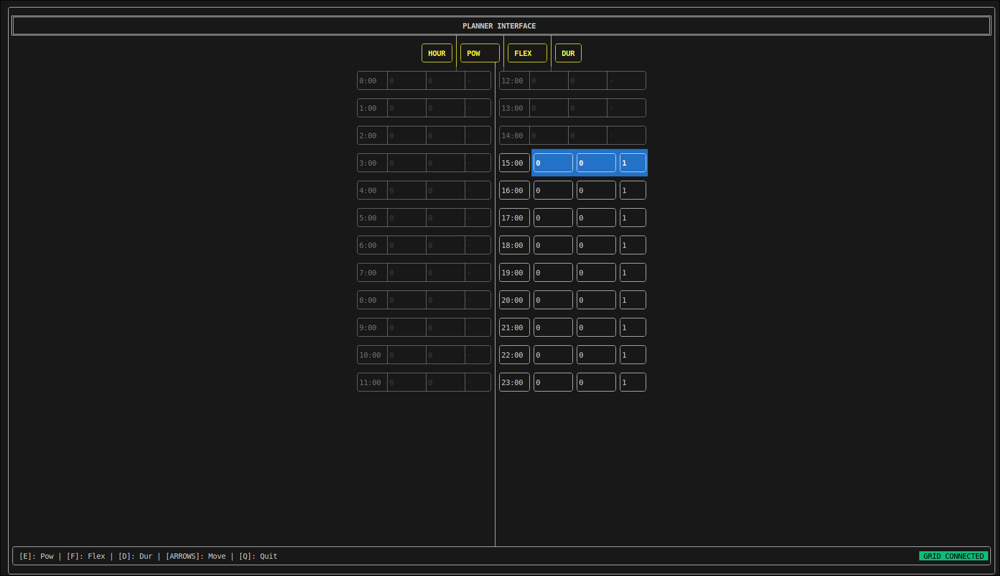

# Socialist Library

**Socialist** is a decentralized power-grid negotiation library designed for MADNESS. It implements a collaborative "social" algorithm where load nodes (consumers) self-organize to match their energy demand with the available supply from sources, prioritizing nodes with lower flexibility to ensure everyone's critical needs are met.

## Core Logic

The negotiation follows a structured collective process:

1.  **Supply Discovery**: Every source node broadcasts a 24-hour vector of maximum available power ($P_{max}$) for each hour.
2.  **Aggregation**: Each load node sums all source vectors to determine the **Global Capacity** for every hour of the day.
3.  **Local Planning**: The user defines a 24-hour power request and assigns a **Flexibility Factor** (1 to 10) to each slot through a simple TUI.
4.  **Collective Awareness**: Load nodes exchange their 24-hour request and flexibility vectors.
5.  **Margin Analysis**: Every node calculates the **Power Margin** for each hour:  
    $Margin(h) = \sum P_{sources}(h) - \sum P_{loads}(h)$
6.  **Conflict Resolution**:
    * If $Margin(h) < 0$, a conflict exists.
    * Nodes compare their flexibility in that specific slot.
    * The node with the **highest flexibility** "surrenders" its slot.
    * The task is moved within a window (the flexibility index defines the max amount of hours that the user permit the task to shift) to the neighbor hour with the **highest margin** (both positive and negative).
    * The cycle repeats until the grid is balanced or no further moves are possible.

## Features

- **Decentralized Optimization**: No central coordinator or master server required.
- **Priority-Based Stability**: Tie-breaking via randomized flexibility decimals prevents "oscillation" (nodes jumping back and forth). It is needed to pick randomly a task when more users' tasks have the same flexibility for the same hour slot.
- **Flexibility Windows**: Movement is constrained by a time-window, ensuring that a "shifted" task still makes sense for the user.
- **Resource Equity**: High-flexibility loads (e.g., EV charging) move to accommodate low-flexibility loads (e.g., medical equipment or refrigerators).
- **Nodes Cleaning**: Each load knows dinamically sources and the other loads, so if one stops to send messages it is considered null, if one enters the grid, the others will ackownledge it.

## Installation

This library requires the [nlohmann/json](https://github.com/nlohmann/json) library for message parsing.

* Include `socialis.hpp` in the required MADS agent.
* Ensure you are using a C++17 compliant compiler and the last version of [MADS](https://github.com/pbosetti/MADS.git);
   Include the repo in the agent's `CMakeLists.txt` file as follow:
```
#
# Along with the other <FetchContent_Declare> sections
#

FetchContent_Declare(negotiator
  GIT_REPOSITORY https://github.com/pure-MADNESS/socialist-lib.git
  GIT_TAG        main
  GIT_SHALLOW    TRUE
)

#
# ...
#

#
# After all the <FetchContent_Declare>
#

FetchContent_MakeAvailable(pugg json socialist <otherlibraries>)

#
# ...
#

#
# Edit the <add_plugin> command
#

add_plugin(<agentname> LIBS Eigen3::Eigen socialist <otherlibraries> SRCS ${SRC_DIR}/<agentname>.cpp)

```

## Usage
The Terminal User Interface (TUI) is dispayed as follow:


As indicated, it is possibile to move along the feasible time slots and on each one of them it is possible to set the required power (Watt), with its flexibility and slots duration (that corresponds to hours duration).

### Initialization
